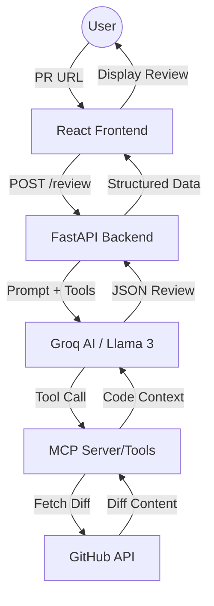

# GitHub PR Reviewer 🔍

An AI-powered GitHub Pull Request reviewer that uses **Groq (Llama-3.3-70b)** and the **Model Context Protocol (MCP)** to provide deep, structured code analysis.

## 🚀 Overview

GitHub PR Reviewer automates the code review process by fetching PR diffs and using an agentic loop to analyze changes. It identifies risks, bugs, and provides actionable suggestions, all within a clean, modern web interface.

### Key Features
- **Agentic Analysis**: Uses a tool-calling loop where the AI decides when to fetch code, metadata, or other context.
- **MCP Integration**: Leverages the Model Context Protocol for secure and standardized tool execution.
- **Fast & Powerful**: Powered by Groq for near-instantaneous AI responses.
- **Structured Feedback**: Returns reviews in a consistent JSON format (Summary, Risk, Issues, Suggestions).

---

## 🏗️ Architecture

The system follows a modern decoupled architecture:



---

## 🛠️ Tech Stack

- **Frontend**: React 19, Vite, Vanilla CSS.
- **Backend**: FastAPI, Groq SDK, FastMCP, Pydantic.
- **Deployment**: Docker, Docker Compose, Nginx.

---

## 🚦 Quick Start

### Prerequisites
- Docker & Docker Compose
- [Groq API Key](https://console.groq.com/)
- [GitHub Personal Access Token](https://github.com/settings/tokens) (Optional but recommended to avoid rate limits)

### Running with Docker (Recommended)
1. Clone the repository.
2. Create a `.env` file in the root directory:
   ```env
   GROQ_API_KEY=your_groq_key_here
   GITHUB_TOKEN=your_github_token_here
   ```
3. Start the application:
   ```bash
   docker-compose up --build
   ```
4. Open [http://localhost:5173](http://localhost:5173) in your browser.

---

## 📂 Project Structure

- `/app`: FastAPI backend source code.
- `/client`: React frontend source code.
- `/tests`: Backend test suite.
- `docker-compose.yml`: Multi-container orchestration.

---

## 📄 License
MIT
